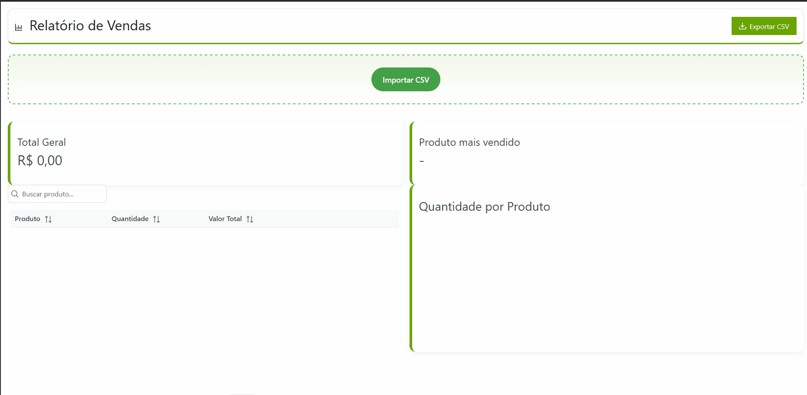

# Desafio Front-end – Dashboard de Vendas - Angular 13

## Descrição

O **Dashboard de Vendas** é um projeto em Angular 13 que permite importar arquivos CSV de vendas, agregá-los por produto e gerar um **relatório interativo** com:

- Tabela de vendas agregadas
- Gráfico de barras por quantidade
- Cards de métricas (Total Geral e Produto Mais Vendido)
- Modal de detalhes do produto
- Exportação de agregados para CSV
- Layout responsivo usando PrimeNG e ngx-bootstrap

Ele segue boas práticas de Angular e é ideal para fins de portfólio ou prova de conceito para sistemas de BI.

---

## Demonstração

---

## Tecnologias

| Tecnologia              | Versão      |
| ----------------------- | ----------- |
| Angular                 | 13.x        |
| PrimeNG                 | 13.0.0-rc.2 |
| ngx-bootstrap           | 6.2.0       |
| TypeScript              | 4.x         |
| HTML5 / SCSS            | -           |
| APIs nativas do browser | FileReader  |

---

## Funcionalidades

| Funcionalidade                         | Status |
| -------------------------------------- | ------ |
| Upload de CSV com validação            | ✔️     |
| Parsing manual do CSV                  | ✔️     |
| Agregação de produtos                  | ✔️     |
| Filtro por produto                     | ✔️     |
| Cards de métricas                      | ✔️     |
| Gráfico de barras                      | ✔️     |
| Modal com detalhes                     | ✔️     |
| Exportar agregados para CSV            | ✔️     |
| Paginação e ordenação na tabela        | ✔️     |
| Formatação monetária pt-BR             | ✔️     |
| Persistência opcional via localStorage | ✔️     |
| Testes unitários básicos               | ✔️     |

---

## Instalação

**Passo 1 - Requisitos**

Antes de começar, você precisa ter instalado:

Node.js (recomendado v16.x LTS)

Baixe aqui: https://nodejs.org

Verifique a versão:

node -v

NPM (geralmente já vem com o Node.js)

Verifique a versão:

npm -v

Angular CLI versão 13

Instale globalmente:

npm install -g @angular/cli@13

Verifique a versão:

ng version

**Passo 2 - Clonar o repositório**

Abra um terminal ou prompt de comando e execute:

git clone https://github.com/CaiqueTuon/desafio-frontend.git
cd desafio-frontend

Isso vai baixar todo o código do projeto para a sua máquina.

**Passo 3 - Instalar dependências**

Dentro da pasta do projeto, execute:

npm install

Isso vai instalar todas as bibliotecas necessárias, incluindo Angular, PrimeNG, ngx-bootstrap, e dependências de build.

Certifique-se de que o package.json tem as versões corretas:

Angular 13.x

PrimeNG 13.0.0-rc.2

ngx-bootstrap 6.2.0

**Passo 4 - Iniciar o servidor de desenvolvimento**

Para rodar o projeto localmente:

ng serve

O Angular CLI vai compilar o projeto e iniciar um servidor local.

O terminal mostrará algo como:

** Angular Live Development Server is listening on localhost:4200, open your browser on http://localhost:4200/ **

**Passo 5 - Abrir no navegador**

Abra o navegador de sua preferência e acesse:

http://localhost:4200

O dashboard será carregado com a tela inicial.

Você pode importar o CSV de exemplo para testar todas as funcionalidades.

## Como Usar

    Clique em “Importar CSV” e selecione um arquivo .csv no formato:

produto,quantidade,preco_unitario
Camiseta,3,49.90
Calça,2,99.90
Camiseta,1,49.90
Tênis,1,199.90

    O dashboard atualizará automaticamente com:

- Total Geral

- Produto mais vendido

- Tabela agregada com filtros e ordenação

- Gráfico de barras

  Clique no ícone 👁 na tabela para abrir o modal de detalhes do produto.

  Clique em “Exportar CSV” para baixar os agregados (produto, quantidade, valor total, total geral, produto mais vendido).

## Testes

Testes unitários cobrem:

    Parsing do CSV

    Agregação de produtos

Execute:

ng test

## CSV de Exemplo

Você pode baixar um CSV de teste pronto aqui:
[Download CSV de exemplo](docs/vendas-exemplo.csv)

MIT © Caique Matias Tuon
